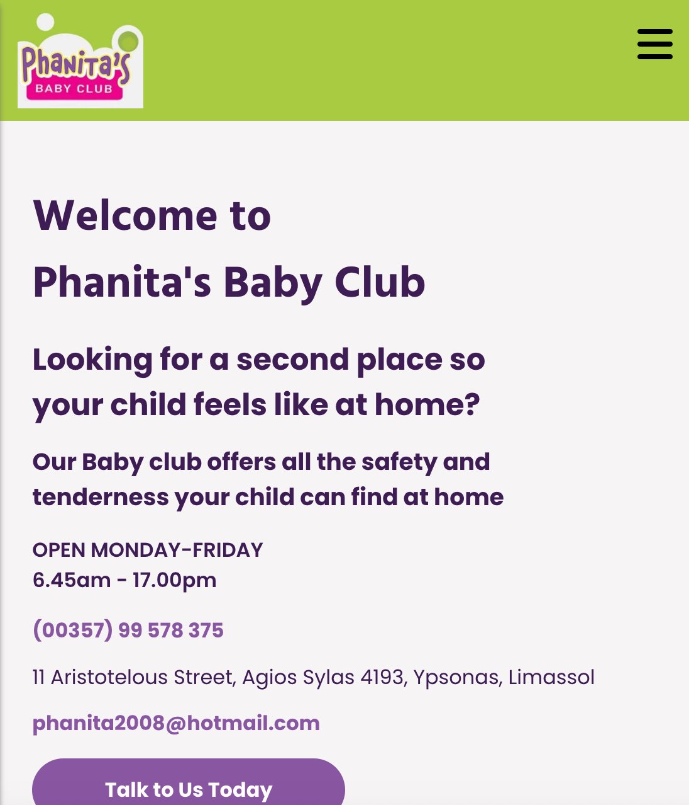
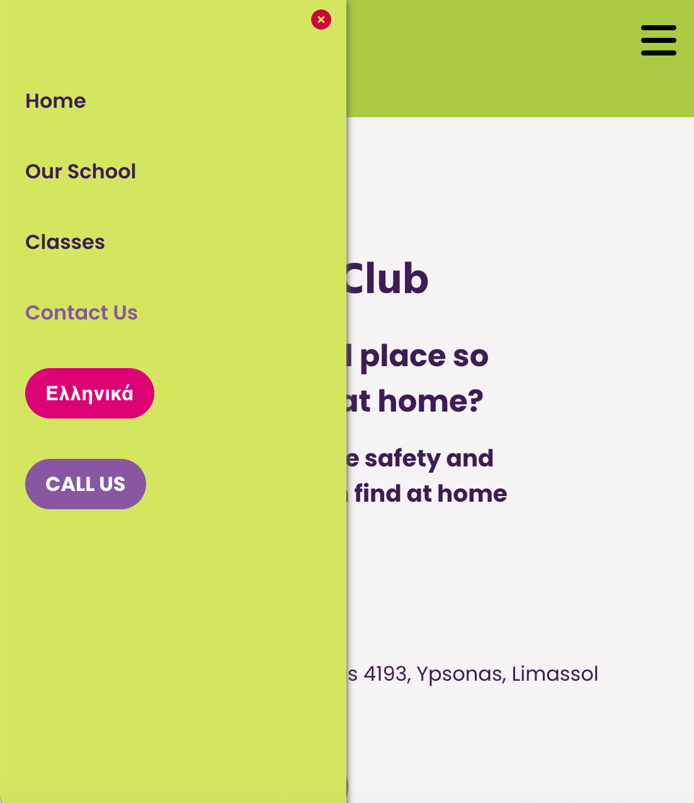
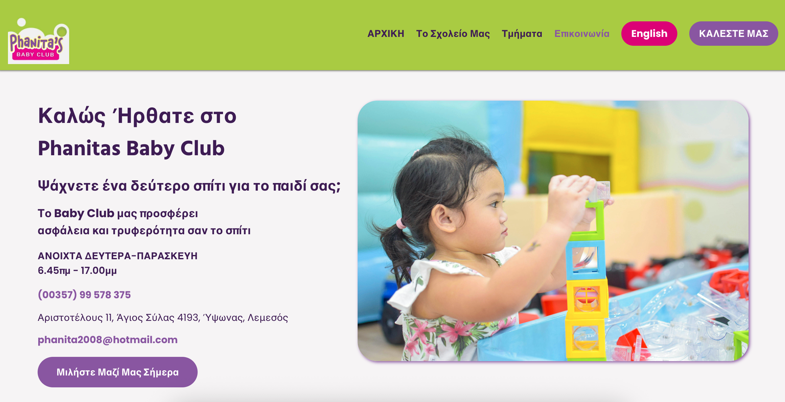

# Phanita's Baby Club - A multilingual fully responsive website built for a local business!

## Table of contents

- [Overview](#overview)
  - [Links](#links)
- [My process](#my-process)
  - [Built with](#built-with)
  - [Skills](#skills)
  - [Continued development](#continued-development)
  - [Useful resources](#useful-resources)

## Overview

A fully responsive, accessible multilingual freelance site redesigned for a local business and built using HTML, CSS and JavaScript.

## Mobile View 

## Resonsive Nav 

## Desktop HomePage in Greek

### The challenge

Users should be able to:

- Toggle between Greek and English
- Submit a message via the contact form

### Links

- Solution URL: (https://github.com/LaurenAMolloy/phanitas-baby-club)
- Live Site URL: (https://phanitasbabyclub.com/)

  ### Built with

- JavaScript
- Semantic HTML5 markup
- CSS custom properties
- Flexbox

### Skills

I utilised skills using JSON data and data attributes. I successfully implemented the language toggle feature by storing each language text in a JSON file and creating a function that looks up the specific key for each HTML attribute. The site is fully responsive acheived by using a combination of CSS flexbox and grid.

### Continued development

I look forward to creating more dynamic applications and exploring how I can implement various API's into my projects.

### Useful resources
- [Multilingual Site Article](https://medium.com/@nohanabil/building-a-multilingual-static-website-a-step-by-step-guide-7af238cc8505) - This helped me to implement the language toggle.

